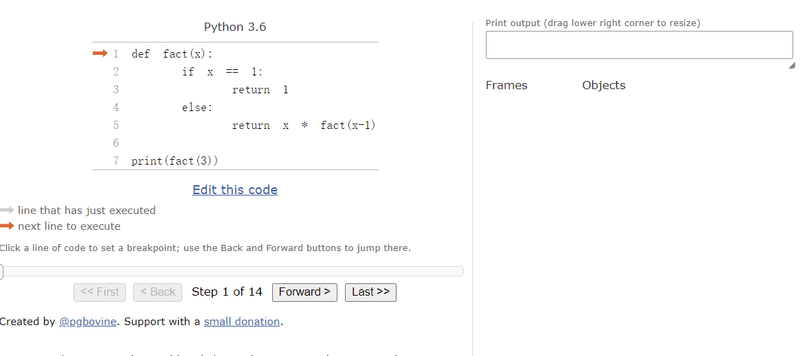

# grokking_algorithms

## 第一章 简介

算法是一组完成任务的指令。

对数：对数运算是幂运算的逆运算。

### 1. 二分查找

二分查找可以简单理解为对半查找，先按照列表的一半的位置判断与期望数字进行比较，如果小的话舍弃右半部分并将中间数值当成最大的数，然后继续进行下一次查找，如果大的话舍弃左半部分并将中间数值当成最小的数，然后继续下一次查找，如果查到最后一个数也不符合则返回`None`。至于代码中的中间值索引加一或者减一是因为之前判断过中间值是否与期望值相同，所以在这个条件不符合时，将这个中间值从下一次判断中排除掉，所以就需要减一加一。

注意：只有当这个查找的列表是有序列表时才管用，而且在运行时计算的只是索引位置并不会产生新的列表。

代码：

[二分查找代码](./s1/binary_search.py)

```python
def binary_search(list, item):
    low = 0
    high = len(list) - 1

    while low <= high:
        mid = (low + high) // 2
        guess = list[mid]
        if guess == item:
            return mid
        elif guess > item:
            high = mid - 1
        else:
            low = mid + 1
    return None
```

### 2. 运行时间


线性时间： 查找的次数与列表长度相同 表示方法：O(n)

对数时间：二分查找的运行时间为对数时间或者log时间 表示方法：O(log n)


大O表示方法：

- 大O表示法指出了算法有多快。
- 大O表示法让你能够比较操作数，它指出了算法运行时间的增速。
- n为操作数。
- 大O表示法指出了最糟情况下的运行时间。


常见的大O运行时间：

- O(log n)，对数时间，二分查找算法
- O(n)，线性时间，简单查找
- O(n*log n)，快速排序（一种速度较快的排序算法）
- O(n^2)，选择排序（一种速度较慢的排序算法）
- O(n!)，旅行商问题（一种非常慢的算法）


大O算法的启示：

- 算法的速度指的并非时间，而是操作数的增速
- 谈论算法的速度时，我们说的是随着输入的增加，其运行时间将以什么样的速度增加
- 算法的运行时间用大O表示法表示
- O(log n)比O(n)快，当需要搜索的元素越多时，前者比后者快得越多。


## 第二章 选择排序

### 1. 内存的工作原理

当需要将数据存储到内存时，可以请求计算机提供存储空间，然后计算机会分配一个存储地址。当需要存储多项数据时，有两种基本方式--数组和链表。


### 2. 数组和链表

数组：

- 在数组中添加新元素可能很麻烦，如果没有了空间，就得转移到内存的其他地方，因此添加新元素的速度会很慢。
- 如果额外请求空间，这可能会浪费内存
- 随机地读取元素时，数组的效率很高，因为可以迅速的找到数组的任何元素
- 在同一个数组中，所有元素的类型都必须相同（都为int、double等）

链表：

- 链表中的元素可以存储在内存的任何地方。
- 链表的每个元素都存储了下一个元素的地址，从而使一系列随机的内存地址串联在一起。
- 在链表中添加元素很容易：只需将其放入内存，并将其地址存储到前一个元素中。
- 使用链表时，根本不需要移动元素
- 链表的优势在插入元素方面
- 需要同时读取所有元素时，链表的效率很高；当需要跳跃时，链表的效率很低。


数组和链表操作的运行时间：

|      | 数组 | 链表 |
| :--: | :--: | :--: |
| 读取 | O(1) | O(n) |
| 插入 | O(n) | O(1) |
| 删除 | O(n) | O(1) |

两种访问方式：

随机访问：数组

顺序访问：链表


### 3. 选择排序


选择排序有两个方法：一个是一个是查找列表中的最小值；另外一个是在新列表中追加最小值，然后在旧列表中pop掉最小值，循环列表长度次，最后返回一个新列表。


[选择排序代码](./s2/selection_sort.py)


for循环遍历查找最小值


```python
def find_smallest(arr):
    smallest = arr[0]
    smallest_index = 0

    for i in range(1, len(arr)):
        if arr[i] < smallest:
            smallest = arr[i]
            smallest_index = i
    return smallest_index

```


for循环追加最小值并在原列表中pop掉 

```python
def selection_sort(arr):
    new_arr = []
    for i in range(len(arr)):
        smallest = find_smallest(arr)
        new_arr.append(arr.pop(smallest))
    return new_arr
```


## 第三章 递归


### 1. 递归

递归简单说就是函数自己调用自己。递归能让解决方案更清晰，但是没有性能上的优势。由于是自己调用自己，所以在使用递归的时候可能会造成死循环，所以得给递归加一个出口。

基线条件：是指函数不再调用自己，从而避免造成死循环。基线条件也可以叫递归出口

递归条件：函数自己调用自己

[简单递归代码](./s3/recursive.py)

简单的代码示例：

```python
def countdown(i):
    print(i)
    if i <= 1:  # 基线条件
        return
    else:  # 递归条件
        countdown(i - 1)
```


### 2. 栈

栈是先入后出

### 3. 调用栈

调用栈用于存储多个函数的变量

### 4. 递归调用栈

递归之所以能实现，是因为函数的每个执行过程都在栈中有自己的形参和局部变量的拷贝，这些拷贝和函数的其他执行毫不相干。

[阶乘的递归实现](./s3/fact.py)




注意，每个函数调用都有自己的变量，在一个函数调用中不能访问另一个函数的变量。

栈中包含了未完成的函数调用，每个函数调用都包含未调用的函数。所以使用栈很方便，因为你无需自己跟踪函数调用和变量。

使用栈虽然很方便，但是也要付出代价：

- 存储详尽的信息可能占用大量的内存
- 每个函数调用都要占用一定的内存，如果栈很高，就意味着计算机存储了大量函数调用的信息。


